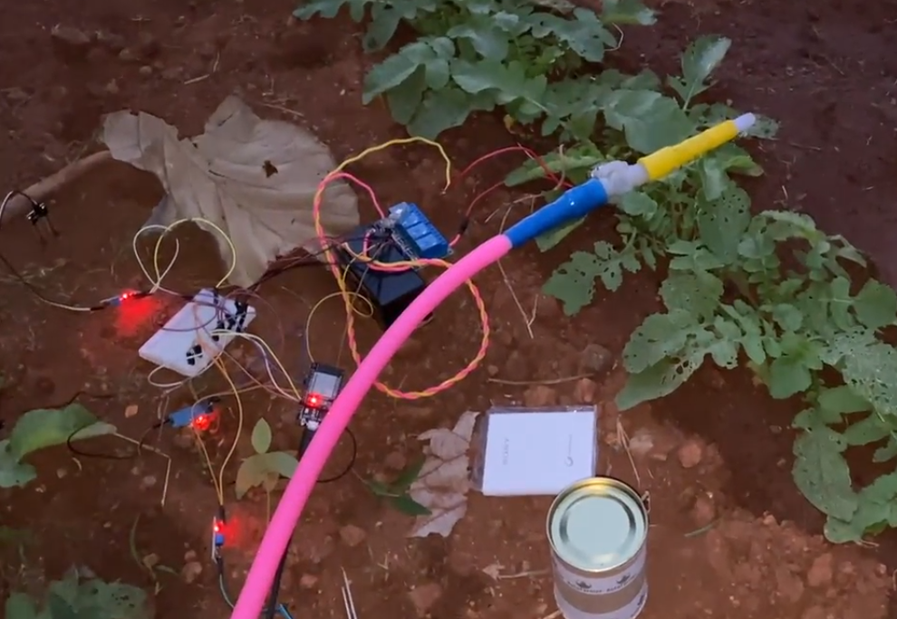

## Ground Control

   

This is the code for the AutoFarmer Ground control. The Autofarmer Ground control consists of an ESP_32 connected to 2 soil moisture sensors, 1 DHT11, which is a humidity and temperature sensor and 1 rain sensor. It also recieves surface soil moisture data and soil moisture data for 10 cm below the soil from a sattelite through an HTTP client.

Based on this data, the ESP_32 decides wether to turn the solenoid value it is connected to on or off. The solenoid is connected to the water supply, and can either release or switch of the water supply.
